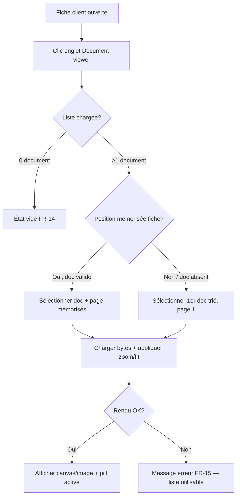
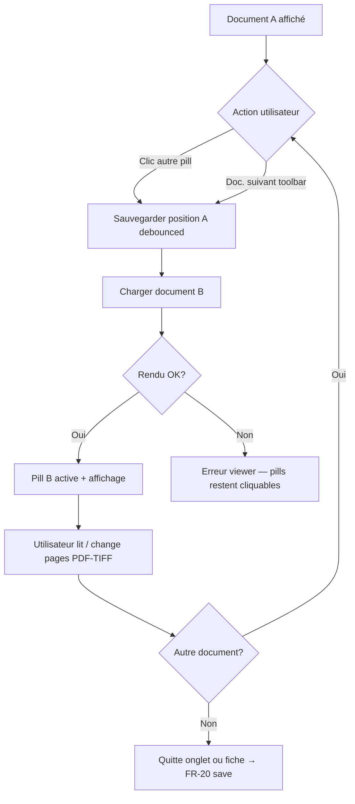
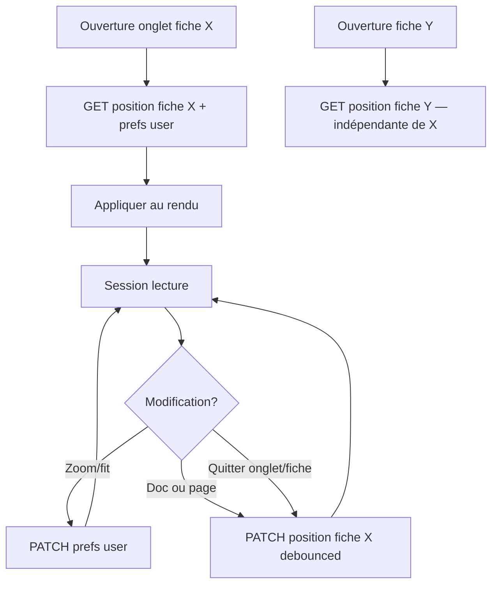

# UX Design Specification document-viewer

**Author:** breaking-code
**Date:** 2026-05-20

---

## Executive Summary

### Project Vision

Intégrer dans la fiche client JSP un onglet **Document viewer** qui regroupe la **sélection** et la **consultation** des pièces du dossier (PDF, JPEG, TIFF). L’utilisateur reste dans le contexte client, enchaîne les documents, retrouve sa **dernière position** (document + page) par fiche, et bénéficie d’une **toolbar** de lecture cohérente (PDF.js / équivalent TIFF). La direction visuelle MVP est **validée par les démos** : layout **M2 bandeau pills** (`demo-layout-1.html`).

### Target Users

- **Primaire :** conseiller / utilisateur métier authentifié, consultation réactive de 3–10 pièces (contrats, KYC, scans).
- **Contexte :** poste interne, navigateur cible Chrome/Edge, onglet parmi d’autres sur la fiche client.
- **Niveau technique :** métier, pas expert PDF ; attente de fiabilité et de reprise de session.
- **Accessibilité :** palier clavier **Standard** recommandé (OQ-9) ; lecteur d’écran à confirmer avec le client.

### Key Design Challenges

- Intégration **non intrusive** dans le shell JSP (tabs, focus, raccourcis globaux JSP).
- **Liste compacte** (pills) lisible avec nom + type pour ~10 entrées.
- **Toolbar** adaptée au type de document (masquer pagination pour JPEG).
- **États métier** explicites : chargement, erreur, dossier vide.
- **Reprise de position** visible (document courant + page) sans désorienter à la réouverture.
- Décisions **en attente** : export (OQ-6), profondeur clavier (OQ-9), rendu TIFF (OQ-8).

### Design Opportunities

- **Reprise document/page par fiche** comme différenciateur d’expérience.
- **Une zone viewer** unifiée pour PDF/TIFF/JPEG avec habitudes communes (zoom, fit).
- **ARIA tablist + toolbar** pour conformité et efficacité clavier (secteur réglementé).
- **Démos jouables** comme socle de recette UX avant intégration JSP.

## Core User Experience

### Defining Experience

L’expérience cœur est la **boucle de consultation** : depuis l’onglet Document viewer, l’utilisateur **sélectionne une pièce** dans le bandeau (pills), la **lit** dans la zone viewer (PDF/TIFF avec pages, JPEG sans pagination), ajuste **zoom/fit** si nécessaire, puis **passe à la pièce suivante** — sans quitter la fiche client. La valeur perçue repose sur la **continuité** (reprise document + page par fiche) et la **fiabilité d’affichage** (PDF.js, pas d’ouverture externe).

### Platform Strategy

- **Plateforme :** application web interne, composant embarqué JSP (desktop).
- **Interaction :** souris prioritaire ; **clavier Standard** (FR-21) en MVP ; pas de cible tactile dédiée.
- **Navigateurs :** Chrome/Edge récents (à confirmer QA) ; service documents en **même origine** / session authentifiée.
- **Hors scope plateforme MVP :** mobile, hors-ligne, application native.

### Effortless Interactions

- **Reprise automatique** de la position de lecture (document + page) à la réouverture de la fiche.
- **Chargement initial** du document pertinent (mémorisé ou premier de la liste) sans clic supplémentaire.
- **Indicateur document courant** (pill sélectionnée + libellé dans la barre viewer).
- **Zoom/fit** pré-appliqués selon préférences utilisateur.
- **Ajustement largeur** pour lisibilité immédiate des PDF (comportement cible des démos).
- **Masquage contextuel** des contrôles non pertinents (ex. pagination pour JPEG).

### Critical Success Moments

1. **Ouverture de l’onglet** — le bon document s’affiche rapidement, lisible (reprise ou premier doc).
2. **Changement de document** — bascule fluide, pill et barre viewer synchronisées.
3. **Retour sur la fiche client** — reprise de la page exacte (ex. contrat page 3).
4. **Gestion d’échec** — erreur ou dossier vide : message clair, possibilité d’essayer un autre document.

### Experience Principles

1. **Contexte fiche préservé** — aucune navigation full-page pour consulter une pièce.
2. **Lecture avant chrome** — UI minimale utile : liste, toolbar essentielle, zone document dominante.
3. **État explicite** — l’utilisateur sait toujours *quel* document et *quelle* page il consulte.
4. **Continuité de session** — reprise et préférences réduisent la reconfiguration répétitive.
5. **Accessibilité intégrée** — tablist, focus visible, toolbar atteignable au clavier (palier Standard).

## Desired Emotional Response

### Primary Emotional Goals

- **Maîtrise et contrôle** — l’utilisateur pilote la consultation depuis un seul endroit prévisible (onglet + pills + toolbar).
- **Efficacité professionnelle** — réduction de la friction par rapport au modèle « un fichier = un bouton ».
- **Confiance dans l’affichage** — le document s’ouvre de façon fiable (PDF.js, messages d’erreur clairs).
- **Concentration** — interface sobre, zone document mise en avant (fond sombre, chrome limité).

### Emotional Journey Mapping

| Phase | Émotion souhaitée | Rôle du design |
|-------|-------------------|----------------|
| Découverte de l’onglet | Clarté, orientation | Libellé onglet explicite ; liste visible |
| Première lecture | Soulagement (ça marche) | Rendu rapide et lisible ; pas d’ouverture externe |
| Navigation inter-documents | Fluidité | Pills + doc. préc./suiv. ; feedback visuel immédiat |
| Reprise sur la fiche | Continuité, reconnaissance | Même doc + même page ; pill déjà sélectionnée |
| Échec (erreur / vide) | Calme, guidage | Ton métier neutre ; issue possible (autre document) |
| Session répétée | Habitude, confiance | Préférences zoom/fit + position mémorisées |

### Micro-Emotions

| Viser | Éviter |
|-------|--------|
| Confiance | Scepticisme (« est-ce le bon fichier ? ») |
| Accomplissement | Frustration (recherche de page perdue) |
| Sérénité | Anxiété (popup, téléchargement forcé) |
| Orientation | Confusion (quel document est ouvert ?) |

### Design Implications

- **Contrôle** → bandeau pills + indicateur document courant + compteur page.
- **Confiance** → états chargement/erreur explicites ; pas de canvas vide sans message.
- **Efficacité** → reprise auto ; toolbar regroupée ; doc. préc./suiv. dans la liste et la barre.
- **Concentration** → palette sobre (démo : vert institutionnel + zone viewer sombre) ; pas d’animations superflues.
- **Calme en erreur** → messages en français métier, ton factuel, pas de codes techniques.

### Emotional Design Principles

1. **Rassurer avant d’impressionner** — fiabilité et clarté passent avant effets visuels.
2. **Ne jamais punir l’utilisateur** — une erreur document n’est pas un échec de parcours global.
3. **La continuité crée la confiance** — reprise position = signal « le système me connaît ».
4. **Réduire le bruit cognitif** — une seule zone de lecture, contrôles secondaires discrets.
5. **Ton institutionnel cohérent** — aligné fiche client assurance / services financiers (pas consumer playful).

## UX Pattern Analysis & Inspiration

### Inspiring Products Analysis

**Adobe Acrobat / lecteurs PDF web** — Référence pour la toolbar (pagination, zoom, fit) et la hiérarchie « contrôles → document ». L’utilisateur métier y retrouve des habitudes sans quitter le navigateur.

**Visionneuses GED et portails assurance** — Pattern **liste + aperçu** (master-detail ou bandeau) ; métadonnées type/date ; volume limité par dossier. Valide M1 (table gauche, démo 2) comme alternative secteur, M2 pills comme MVP.

**SharePoint / stockage documentaire (aperçu inline)** — Consultation sans téléchargement systématique ; aligné objectif « rester dans la fiche ».

**Démos internes `demo-layout-1.html` / `demo-viewer-libraries.html`** — Prototype validé : pills, PDF.js, palette institutionnelle (`dj`), états chargement/erreur, navigation doc. préc./suiv. **Source de vérité visuelle MVP.**

### Transferable UX Patterns

**Navigation**
- Pills `role="tablist"` avec `aria-selected` — sélection document (FR-3, FR-21).
- Onglet « Document viewer » dans la fiche — entrée unique (FR-1).

**Interaction**
- Toolbar compacte au-dessus du canvas — pages, zoom ±, largeur/hauteur, doc. préc./suiv.
- Reprise position à l’ouverture — différenciateur vs ancien modèle boutons dispersés.
- Compteur « doc. N / total » + « page X / Y » — confiance et orientation.

**Visuel**
- Fond viewer sombre (`neutral-800`) — focus lecture (émotion concentration).
- Accent vert institutionnel — cohérence charte / démos ; pills sélectionnées inversées (fond `dj`, texte blanc).
- Bandeau info sous header onglet — contexte MVP / mode viewer (optionnel en prod).

### Anti-Patterns to Avoid

- **Un bouton par fichier** sur la fiche — friction, perte de contexte (problème initial).
- **Viewer PDF natif iframe** — téléchargement, zone noire, comportement navigateur (démo A non retenue).
- **Pagination visible pour JPEG** — confusion sur le type de document.
- **Absence de feedback** pendant chargement — anxiété, clic répété.
- **Erreurs techniques brutes** — rupture de confiance (secteur réglementé).
- **Trop de layouts en prod** — M1/M3 réservés feedback ; un seul layout MVP (M2).

### Design Inspiration Strategy

**Adopter tel quel**
- Layout M2 bandeau pills + viewer (démo 1).
- Toolbar PDF.js et logique fit largeur à l’ouverture.
- États vide / erreur / chargement avec libellés métier.

**Adapter**
- Patterns Acrobat → raccourcis clavier **palier Avancé** seulement si OQ-9 client.
- Master-detail M1 → variante client, pas branche MVP par défaut.
- TIFF → même toolbar pages que PDF une fois moteur choisi (OQ-8).

**Éviter**
- Nouvel onglet navigateur par document.
- UI consumer (grilles Pinterest, preview flottant sans liste explicite).
- Surcharge toolbar (impression/téléchargement) tant que OQ-6 non tranché.

## Design System Foundation

### 1.1 Design System Choice

**Système retenu (production) :** le **framework UI existant** de l’application fiche client JSP (composants, tokens, typo, grilles déjà en place).

**Rôle des démos (`_bmad-output/demos/`) :** prototypes **UX/layout** (Tailwind + Alpine + PDF.js) — **pas** la stack visuelle cible prod. À l’implémentation : réimplémenter la structure M2 + toolbar avec les **composants natifs** du framework (boutons, onglets/pills équivalents, alertes, spinners).

**Libs viewer (hors charte) :** PDF.js (+ moteur TIFF OQ-8) ; logique état possible en JS du projet (Alpine ou équivalent existant).

### Rationale for Selection

- Charte et composants **déjà définis** — pas de nouvelle fondation couleur/typo dans ce document.
- Cohérence visuelle avec le reste de la fiche client (onglets, formulaires, messages).
- Les démos valident **l’information architecture** et les **interactions**, pas une seconde design system parallèle.

### Implementation Approach

1. **Mapper** chaque zone de la démo 1 vers un composant framework : sélecteur documents, barre d’actions, zone contenu, états vide/erreur/chargement.
2. **Ne pas importer** Tailwind en prod sauf si déjà présent sur la fiche.
3. **Conserver** hiérarchie : liste (pills) → toolbar → canvas viewer fond sombre si le framework le permet, sinon variante « contenu » standard.
4. **Accessibilité** — réutiliser patterns focus/ARIA du framework ; compléter tablist viewer si absent (FR-21).

### Customization Strategy

- **Garder (UX)** : layout M2, interactions, libellés, états.
- **Adapter (visuel)** : classes/tokens du framework client à la place des tokens `dj` des démos.
- **Extensions post-MVP** : M1/M3 layouts, raccourcis (OQ-9), export (OQ-6).

## Visual Design Foundation

**Étape 8 — non applicable (décision breaking-code, 2026-05-20).**

Couleurs, typographie et espacement sont **hérités du framework UI existant** de la fiche client. Ce document ne définit pas de palette ni d’échelle typo propres au viewer.

**Référence visuelle interaction/layout uniquement :** démos GitHub Pages + section *Design Inspiration Strategy* ci-dessus.

**À documenter côté équipe JSP :** nom du framework, composants à réutiliser (tabs, buttons, alerts), contraintes charte (contraste, focus).

## Design Directions

**Étape 9 — non applicable (décision breaking-code, 2026-05-20).**

Directions visuelles déjà couvertes par les **démos jouables** (`demo-layout-1` MVP, `demo-layout-2` M1, `demo-layout-3` M3) — pas de `ux-design-directions.html` supplémentaire.

## 2. Core User Experience

### 2.1 Defining Experience

**L’interaction définissante :** *« Choisir une pièce dans le bandeau et la lire tout de suite — là où je me suis arrêté. »*

Un clic sur une **pill** charge le document dans le viewer **dans l’onglet**, à la **bonne page**, avec un rendu **fiable** (PDF.js / équivalent TIFF). L’utilisateur décrit le produit par le résultat : *« Tous mes documents sont au même endroit sur la fiche client. »*

### 2.2 User Mental Model

**Aujourd’hui :** un bouton ou lien par fichier → ouverture externe, perte de contexte, recherche manuelle de la dernière page.

**Modèle attendu :** **classeur numérique** sur la fiche — onglet Documents, pills = pièces, zone sombre = lecture, toolbar = contrôles lecteur.

**Confusion à éviter :** fichier ouvert non identifié ; PDF vide ; pagination sur JPEG ; perte de page après fermeture fiche.

### 2.3 Success Criteria

| Indicateur | Cible perçue |
|----------|----------------|
| Temps jusqu’au document lisible | < 3 s (réseau interne) |
| Reprise fiche | Bon doc + page sans action manuelle |
| Bascule document | < 2 s ; pill active immédiatement |
| Compréhension état | doc N/total et page X/Y si paginé |
| Échec recoverable | Autre document sélectionnable après erreur |

### 2.4 Novel UX Patterns

**Établi** — tablist + bandeau + toolbar PDF (GED / Acrobat).

**Twist :** bookmark implicite **par fiche client** ; double accès doc. suivant (pills + toolbar).

**Pas de modal « reprendre ? »** — reprise silencieuse.

### 2.5 Experience Mechanics

1. **Initiation** — onglet Document viewer → liste + position mémorisée ou premier doc.
2. **Interaction** — pill / clavier → chargement → pages, zoom, fit ; changement doc sauvegarde position (debounced).
3. **Feedback** — pill sélectionnée, libellé barre, chargement/erreur, `aria-live` page.
4. **Completion** — persistance à la sortie ; retour autres onglets fiche sans perdre session client.

## User Journey Flows

**Source narrative :** PRD §2.4 (UJ-1 à UJ-3) + cas d’usage BA (CU-1 à CU-7). IDs PRD conservés.

### UJ-1 — Reprendre la lecture à l’ouverture de l’onglet

**Objectif :** Ouvrir Document viewer et voir immédiatement le bon document à la bonne page (ou repli premier doc).

**Écrans :** onglet fiche (tabs) → zone viewer (liste pills + toolbar + canvas).  
**Feedback :** pill sélectionnée, libellé barre, « page X / Y », chargement.

### UJ-2 — Comparer plusieurs pièces du dossier

**Objectif :** Enchaîner les documents sans quitter la fiche.

**Optimisation :** doc. préc./suiv. **désactivés** aux bornes de la liste.

### UJ-3 — Préférences et position par fiche

**Objectif :** Zoom/fit globaux + position **par clientId** distincte.

### Parcours secondaires

**CU-6 — Dossier vide :** après B→C→0 doc → message métier, pas de toolbar pages active.

**CU-7 — Erreur fichier :** branche K/G — message dans zone viewer, sélection autre pill possible.

**JPEG :** dans UJ-2, masquer Page −/+ ; fit/zoom selon même toolbar ou simplifiée.

**TIFF multi-pages :** même flux pages que PDF (FR-10b).

### Journey Patterns

| Pattern | Usage |
|---------|--------|
| **Charger → feedback → agir** | Toute sélection pill déclenche load + état chargement |
| **Sélection visible** | Pill + barre titre viewer toujours synchronisées |
| **Repli gracieux** | Position invalide → 1er doc ; page > max → dernière page |
| **Persistance silencieuse** | Pas de modal ; save debounced sur navigation |
| **Liste toujours active** | Erreur n’isole pas l’utilisateur |

### Flow Optimization Principles

1. **Zéro clic superflu** à l’ouverture si position valide (UJ-1).
2. **Une seule zone d’erreur** (viewer), jamais toute la fiche.
3. **Bascule document ≤ 2 s** perçus (SM-3).
4. **Ne pas re-demander** zoom à chaque visite (UJ-3 prefs).
5. **Composants framework** pour états vide/erreur/chargement — patterns déjà connus des utilisateurs.

## Component Strategy

**Référence structure :** `demo-layout-1.html` (MVP M2). **Production :** composants du framework UI JSP existant — noms ci-dessous en **équivalents génériques** ; l’équipe JSP mappe vers les composants réels (Bootstrap, PrimeFaces, custom, etc.).

### Design System Components

| Besoin UX | Équivalent framework (à confirmer JSP) | Source démo |
|-----------|----------------------------------------|---------------|
| Onglet fiche « Document viewer » | **Tabs** / navigation onglets existante | L.33–36 démo |
| Boutons actions | **Button** (primary, disabled) | Toolbar, doc. préc./suiv. |
| Message dossier vide / erreur | **Alert** / **Empty state** | FR-14, FR-15 |
| Chargement document | **Spinner** / skeleton | L.79 démo |
| Conteneur carte | **Panel** / **Card** | Bandeau documents + viewer |
| Badge type fichier | **Badge** / **Label** | Pastille `PDF`/`JPEG`/`TIFF` sur pill |

**Couverture :** ~80 % de l’UI shell par le framework. **Hors charte :** rendu PDF.js / TIFF (canvas), logique état viewer.

### Custom Components

Composants **métier viewer** — composition de primitives framework + intégration libs.

#### DocumentViewerPanel (racine onglet)

**Purpose :** Conteneur de l’onglet Document viewer dans la fiche client.  
**Usage :** Monté à l’activation de l’onglet ; reçoit `clientId`, session auth.  
**Anatomy :** (1) bandeau liste documents, (2) zone viewer (chrome + toolbar + stage).  
**States :** `idle`, `loading-list`, `ready`, `empty-dossier`, `error-list` (rare).  
**Accessibility :** `region` avec `aria-label="Document viewer"` ; ne pas piéger le focus hors onglet fiche.

#### DocumentPillTablist

**Purpose :** Sélectionner le document actif parmi le dossier (~3–10 entrées).  
**Content :** Libellé court (`pillLabel` ou nom), badge type (PDF/JPEG/TIFF).  
**Actions :** Clic pill ; optionnel doc. préc./suiv. + compteur `N / total`.  
**States :** `default`, `selected`, `hover`, `focus`, `disabled` (pendant load optionnel).  
**Variants :** MVP = pills horizontales wrap ; M1/M3 = hors scope (table / vignettes).  
**Accessibility :** `role="tablist"`, chaque pill `role="tab"`, `aria-selected`, roving tabindex (FR-21).

#### ViewerChromeBar

**Purpose :** Afficher le document courant et le mode (PDF / image / TIFF).  
**Content :** Nom fichier ou libellé métier ; indicateur mode (`viewerMode`).  
**States :** synchro avec pill sélectionnée.  
**Accessibility :** `aria-live="polite"` sur changement de document.

#### ViewerToolbar

**Purpose :** Contrôles de lecture selon type MIME.  
**Actions :** Page −/+ ; Zoom −/+ ; Ajuster largeur / hauteur ; Doc. préc. / Doc. suiv. (optionnel si doublon pills).  
**States :** `pdf-tiff-full`, `jpeg-reduced` (sans pagination), `disabled` (bornes page/doc), `hidden` (dossier vide).  
**Accessibility :** `role="toolbar"`, `aria-label="Contrôles du document"`, boutons nommés, ordre tab cohérent.

#### ViewerStage

**Purpose :** Zone de rendu (canvas PDF.js, `` JPEG, canvas TIFF).  
**States :** `loading`, `ready`, `error` (message métier dans la zone).  
**Interaction :** scroll interne si contenu > viewport ; fit largeur par défaut à l’ouverture PDF.  
**Accessibility :** Contenu document souvent non structuré — annoncer chargement/erreur via `aria-live`.

#### ViewerPersistenceController (logique, pas UI)

**Purpose :** GET/PATCH position par fiche + prefs utilisateur (addendum API).  
**Triggers :** ouverture onglet, changement doc/page debounced, changement zoom/fit, leave onglet/fiche.

### Component Implementation Strategy

1. **Composer** `DocumentViewerPanel` à partir de primitives framework — pas de duplication charte.
2. **Isoler** `ViewerStage` + adaptateurs `PdfRenderer`, `JpegRenderer`, `TiffRenderer` (interface commune : `load`, `setPage`, `zoom`, `fitWidth`, `fitHeight`, `destroy`).
3. **État central** (store module JS ou équivalent existant fiche) : `documents[]`, `selectedId`, `page`, `prefs`, `loading`, `error`.
4. **Ne pas bloquer** la liste en cas d’erreur sur un fichier (CU-7).
5. **Tests composants** : mapping QA TC existants → pills, toolbar, états vide/erreur.

### Implementation Roadmap

| Phase | Composants | Parcours / FR |
|-------|------------|---------------|
| **P1 — Shell** | Fiche tab + `DocumentViewerPanel` + liste API docs | FR-1, FR-2, FR-3, UJ-1 |
| **P1 — Lecture PDF** | `DocumentPillTablist`, `ViewerToolbar`, `ViewerStage` (PDF.js) | FR-4–6, FR-9, UJ-1/2 |
| **P2 — Formats** | `JpegRenderer`, `TiffRenderer` + toolbar adaptative | FR-7, FR-10, OQ-8 |
| **P2 — Persistance** | `ViewerPersistenceController` | FR-11–13, FR-19–20, UJ-3 |
| **P3 — Clavier** | Focus tablist + toolbar (Standard) | FR-21, OQ-9 |
| **P3+ — Optionnel** | Export print/download (OQ-6), layout M1/M3, clavier Avancé | FR-17–18, FR-22 |

**Livrable dev recommandé :** tableau de correspondance `demo-layout-1` sélecteur CSS/rôle → composant framework réel (à compléter par l’équipe JSP).

## UX Consistency Patterns

Patterns transverses pour le viewer embarqué. **Formulaires / recherche / modales :** hors scope MVP (pas de saisie dans l’onglet).

### Button Hierarchy

| Niveau | Usage | Exemple |
|--------|--------|---------|
| **Primaire** | Action de lecture immédiate dans la toolbar | Page +, Zoom +, Ajuster largeur |
| **Secondaire** | Navigation document ou ajustement alternatif | Doc. préc./suiv., Ajuster hauteur, Zoom − |
| **Tertiaire / ghost** | Sélection document (pills non sélectionnées) | Pill inactive — bordure, fond neutre |
| **Sélection forte** | Document actif | Pill sélectionnée — style « filled » framework |
| **Désactivé** | Borne atteinte ou document non prêt | `disabled` + opacité réduite (démo : 40 %) |

**Règles :** une seule action primaire visuelle par zone (toolbar vs bandeau pills). Pas de bouton « Télécharger » / « Imprimer » tant que OQ-6 non validé.

### Feedback Patterns

| Type | Quand | Où | Comportement |
|------|--------|-----|--------------|
| **Chargement** | Fetch liste ou bytes document | Zone viewer (spinner/texte) | Bloquer uniquement le stage, pas les pills |
| **Erreur fichier** | 404, corrompu, type non supporté | Zone viewer (alert danger) | Message **métier** ; liste reste cliquable |
| **Dossier vide** | 0 document | Bandeau + viewer (empty state) | Pas de toolbar pages |
| **Info** | Mode viewer (PDF/JPEG/TIFF) | `ViewerChromeBar` | Texte discret, pas de toast |
| **Succès** | Persistance position/prefs | **Aucun toast** | Silencieux (FR-20) — confiance par reprise à la prochaine visite |

**Anti-pattern :** stack trace, code HTTP visible, modal bloquante pour erreur document.

### Form Patterns

**N/A MVP** — aucun champ de saisie dans l’onglet Document viewer. Préférences et position via API backend, pas de formulaire utilisateur.

### Navigation Patterns

**Onglet fiche (shell JSP)**
- Pattern existant de la fiche : activation onglet sans navigation full-page.
- Le viewer ne redéfinit pas le comportement des autres onglets.

**Liste documents (pills)**
- `role="tablist"` ; une pill = un onglet document.
- Clic = chargement immédiat ; pill active toujours visible (wrap horizontal).
- Raccourcis optionnels : doc. préc./suiv. dans bandeau (doublon toolbar accepté pour efficacité).

**Toolbar viewer**
- Ordre logique : pagination → zoom → fit → (doc. préc./suiv. si présent).
- Masquage **Page −/+** pour JPEG ; conservation zoom/fit si pertinent.

**Focus clavier (Standard, FR-21)**
- Tab : pills → toolbar → retour shell fiche.
- Entrée/Espace : activer pill ou bouton focusé.
- Pas de piège focus dans le canvas PDF.

### Additional Patterns

**États vides**
- Libellé métier du type « Aucun document pour ce dossier ».
- Placeholder neutre dans le viewer ; pas de fausse toolbar.

**Overlays / modales**
- **Aucune** pour le flux lecture MVP.
- Pas de lightbox plein écran — lecture dans le conteneur fiche.

**Recherche / filtre**
- Hors scope MVP ; tri simple date optionnel côté API (FR-3), pas de UI filtre dédiée.

**Progression**
- Compteurs explicites : `document 2 / 7`, `page 3 / 12`.
- Pas de barre de progression globale sauf spinner chargement.

**Intégration framework**
- Réutiliser tokens **alert / button / disabled** du framework pour tous les patterns ci-dessus.
- Libellés français alignés `livrables-ba.md` et démos.

## Responsive Design & Accessibility

### Responsive Strategy

| Plateforme | Stratégie |
|------------|-----------|
| **Desktop (cible MVP)** | Layout M2 pills + viewer pleine largeur utile de l’onglet fiche ; `max-width` optionnel aligné contenu fiche (démo : ~`max-w-6xl`). Zone viewer hauteur `min(70vh, 560px)` scroll interne. |
| **Tablette** | **Best effort** — pills en wrap ; toolbar en lignes multiples ; pas de refonte dédiée MVP. |
| **Mobile** | **Hors scope MVP** (PRD) — pas de tests ni d’optimisation tactile requis. |

**Desktop — usage de l’espace**
- Bandeau pills horizontal en tête du viewer (pas de colonne latérale MVP).
- Canvas PDF centré, scroll vertical dans le stage.
- Doc. préc./suiv. dans bandeau **et** toolbar acceptés (écrans larges).

**Approche :** **desktop-first** (poste interne conseiller). Pas de media queries spécifiques viewer sauf contraintes du framework fiche parent.

### Breakpoint Strategy

- **Breakpoints viewer :** hérités du **shell JSP / framework** — pas de grille custom Tailwind en prod.
- **Seuil critique interne :** ~`768px` — si largeur onglet insuffisante, pills passent en **wrap multi-lignes** (comportement flex démo 1).
- **Pas de breakpoint** pour basculer M2 → M1/M3 en prod MVP.

### Accessibility Strategy

**Cible recommandée :** **WCAG 2.1 niveau AA** sur le composant viewer, **sous réserve OQ-9** (confirmation client).

| Exigence | Implémentation |
|----------|----------------|
| **Clavier — Standard (FR-21)** | Tablist pills ; toolbar boutons ; Page −/+ ; doc. préc./suiv. ; focus visible framework |
| **Clavier — Avancé (FR-22)** | Optionnel post-MVP si OQ-9 = Avancé (raccourcis globaux, +/− zoom) |
| **Contraste** | Hérité framework ; barre viewer sombre : texte clair sur fond sombre (vérifier ratio AA sur chrome bar) |
| **ARIA** | `tablist` / `tab` / `aria-selected` ; `role="toolbar"` ; `aria-live="polite"` changement page/document |
| **Canvas PDF** | Contenu non structuré — annoncer états load/error ; pas d’obligation d’étiqueter chaque mot du PDF |
| **Lecteur d’écran** | À valider en recette QA avec NVDA/JAWS si exigence portail ; priorité MVP = clavier + focus |
| **Cibles tactiles** | Desktop souris — 44×44px **recommandé** si tablette un jour ; non bloquant MVP |

**Conflits clavier :** documenter raccourcis **globaux JSP** à ne pas écraser (OQ-9) ; pas de capture clavier agressive sur le canvas en palier Standard.

**Référence détaillée :** PRD §8.1, `addendum.md` §9, `livrables-qa.md` cas accessibilité.

### Testing Strategy

**Responsive**
- Viewport desktop standard poste interne (ex. 1920×1080, 1366×768).
- Réduction largeur fenêtre → wrap pills, toolbar lisible.
- Chrome + Edge (NFR-1).

**Accessibilité**
- Parcours clavier seul : UJ-1 (ouverture + reprise), UJ-2 (changement doc), toolbar pages.
- Inspecteur : rôles ARIA tablist/toolbar, `aria-selected`, focus trap absent.
- Outil automatisé (axe, Lighthouse a11y) sur page intégrée JSP.
- **Si OQ-9 AA confirmé :** test NVDA ou JAWS sur 3 scénarios QA (liste, PDF multipage, erreur fichier).

**Performance perçue**
- Premier rendu PDF < 3 s réseau interne (NFR-4) — aligné SM-3.

### Implementation Guidelines

**Responsive**
- Unités relatives (`rem`, `%`, `min/max-height`) pour hauteur viewer.
- `flex-wrap` sur pills ; pas de largeur fixe par pill.
- Images JPEG : `max-width: 100%` dans le stage.

**Accessibilité**
- HTML sémantique : `<button type="button">` pour pills et toolbar (pas de `
`).
- États `disabled` + `aria-disabled` si framework le supporte.
- Ne pas retirer outline focus — utiliser style focus framework.
- Annoncer « Chargement… » / message erreur dans région `aria-live`.
- Tests automatisés : au moins 1 test e2e clavier par FR-21 (QA).

**Hors scope implémentation UX**
- Support mobile dédié, gestes pinch-zoom natifs, mode high-contrast custom (sauf si framework global).

---

## Workflow Completion

**Workflow [CU] `bmad-create-ux-design` — terminé le 2026-05-20.**

| Étape | Statut |
|-------|--------|
| 1–7 Discovery & core UX | ✅ |
| 8 Visual foundation | N/A (charte JSP) |
| 9 Design directions | N/A (démos 1/2/3) |
| 10 User journeys | ✅ |
| 11 Component strategy | ✅ |
| 12 UX patterns | ✅ |
| 13 Responsive & a11y | ✅ |
| 14 Completion | ✅ |

**Actifs visuels de référence (hors spec) :** `_bmad-output/demos/` — notamment `demo-layout-1.html` (MVP). Pas de `ux-color-themes.html` ni `ux-design-directions.html` (non produits).

**Décisions ouvertes à traiter en planning / archi :** OQ-6 (print/download), OQ-7/8 (fetch + TIFF), OQ-9 (palier clavier / WCAG).
